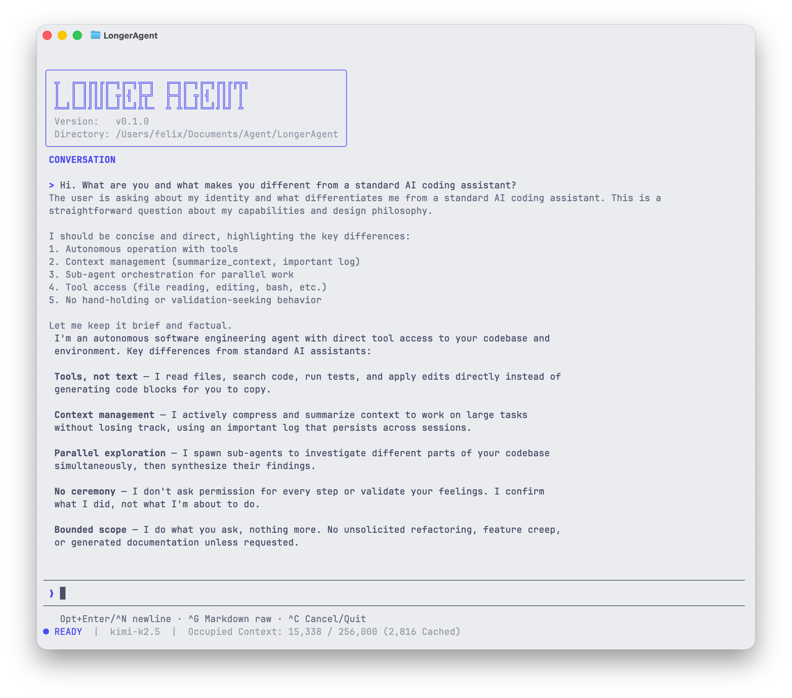

<p align="center">
  
</p>
<p align="center">
  <strong>A terminal AI coding agent built for long sessions.</strong>
</p>
<p align="center">
  <a href="./LICENSE"></a>
  
  
  
</p>

Most AI agents crash, loop, or silently lose context when conversations get long. LongerAgent is built from the ground up for sessions that last hours — with a structured log architecture, three-layer context management, and persistent memory that survives across sessions.



---

## Why LongerAgent

### Sessions That Actually Last

Other agents hit the context window and fall apart. LongerAgent has three layers working together to keep things under control:

1. **Hint Compression** — As context grows, the system prompts the agent to proactively summarize older segments
2. **Agent-Initiated Summarization** — The agent inspects its own context distribution via `show_context` and surgically compresses selected segments with `summarize_context`, preserving key decisions and unresolved issues
3. **Auto-Compact** — Near the limit, the system performs a full context reset with a continuation summary — the agent picks up exactly where it left off

The agent also maintains an **Important Log** — a persistent engineering notebook that survives every compaction. Key discoveries, failed approaches, and architectural decisions are never lost.

### Persistent Memory Across Sessions

Two `AGENTS.md` files are automatically loaded on every turn:

- **`~/AGENTS.md`** — Global preferences and conventions across all projects
- **`<project>/AGENTS.md`** — Project-specific architecture insights and patterns

These files persist across sessions and context resets. The agent reads them for background context and can write to them to save long-term knowledge.

### Parallel Sub-Agents

Spawn sub-agents from YAML call files for parallel work. Three built-in templates:

- **main** — Full-capability agent with all tools
- **explorer** — Read-only agent for codebase exploration
- **executor** — Task-focused agent with basic tools, no orchestration overhead

Sub-agents run concurrently. The main agent tracks their progress via `check_status` / `wait` and receives structured reports when they complete. The TUI shows real-time tool call timing for every operation.

### Talk While It Works

Type messages at any time — even while the agent is mid-task. Messages are queued and delivered at activation boundaries. The agent receives a notification so it knows when new input arrived.

## Quick Start

```bash
# Install globally
npm install -g longer-agent

# Run the setup wizard (creates ~/.longeragent/config.yaml)
longeragent init

# Start
longeragent
```

## Supported Providers

| Provider | Models | Env Variable |
|----------|--------|-------------|
| **Anthropic** | Claude Haiku 4.5, Opus 4.6, Sonnet 4.6 (+ 1M context variants) | `ANTHROPIC_API_KEY` |
| **OpenAI** | GPT-5.2, GPT-5.2 Codex, GPT-5.3 Codex, GPT-5.4 | `OPENAI_API_KEY` |
| **Kimi / Moonshot (China)** | Kimi K2.5, K2 Instruct | `KIMI_CN_API_KEY` |
| **Kimi / Moonshot (Global)** | Kimi K2.5, K2 Instruct | `KIMI_API_KEY` |
| **MiniMax** | M2.1, M2.5 | `MINIMAX_API_KEY` |
| **GLM / Zhipu** | GLM-5, GLM-4.7 | `GLM_API_KEY` |
| **OpenRouter** | Curated presets for Claude, GPT, Kimi, MiniMax, GLM, plus any custom model | `OPENROUTER_API_KEY` |

## Tools

**15 built-in tools:**

`read_file` · `list_dir` · `glob` · `grep` · `edit_file` · `write_file` · `apply_patch` · `bash` · `bash_background` · `bash_output` · `kill_shell` · `diff` · `test` · `web_search` · `web_fetch`

`read_file` supports image files (PNG, JPG, GIF, WebP, etc.) on multimodal models — the agent can directly see and analyze images.

**8 orchestration tools:**

`spawn_agent` · `kill_agent` · `check_status` · `wait` · `show_context` · `summarize_context` · `ask` · `plan`

**Skills system** — Load reusable skill definitions as a dynamic `skill` tool. Manage with `/skills` (checkbox picker for enable/disable), hot-reload with `reload_skills`. Includes a built-in `skill-manager` that teaches the agent to search, download, and install new skills autonomously.

**MCP Integration** — Connect to Model Context Protocol servers for additional tools.

## Slash Commands

| Command | Description |
|---------|-------------|
| `/model` | Switch between configured models at runtime |
| `/thinking` | Control thinking/reasoning depth per model |
| `/skills` | Enable/disable skills with a checkbox picker |
| `/resume` | Resume a previous session from its log |
| `/compact` | Manually trigger context compaction |

## Configuration

LongerAgent loads bundled defaults from the installed package and user overrides from `~/.longeragent/`.
`longeragent init` creates `config.yaml` plus empty override directories.

```text
~/.longeragent/
├── config.yaml            # Model and provider configurations (created by init)
├── settings.json          # Runtime tuning (optional)
├── tui-preferences.json   # Auto-saved TUI state
├── agent_templates/       # User template overrides
├── skills/                # User skills
└── prompts/               # User prompt overrides
```

See [configExample.yaml](./configExample.yaml) for a configuration reference.

### Runtime Settings (`settings.json`)

```jsonc
{
  // Override max output tokens (clamped to [4096, model max])
  "max_output_tokens": 32000,
  // Context management thresholds (percentage of effective context, 20-95)
  "context": {
    "summarize_hint_level1": 60,
    "summarize_hint_level2": 80,
    "compact_output": 85,
    "compact_toolcall": 90
  }
}
```

## Architecture

LongerAgent is built around a **Session → Agent → Provider** pipeline:

- **Session** orchestrates the turn loop, message delivery, summarization, compaction, and sub-agent lifecycle
- **Session Log** is the single source of truth — 20+ entry types capture every runtime event; the TUI display and provider input are both projections of the same data
- **Agent** wraps a model + system prompt + tools into a reusable execution unit
- **Provider** adapters normalize streaming, reasoning, tool calls, and usage across 7 provider families

## CLI Options

```text
longeragent                     # Start with auto-detected config
longeragent init                # Run setup wizard
longeragent --config <path>     # Use a specific config file
longeragent --templates <path>  # Use a specific templates directory
longeragent --verbose           # Enable debug logging
```

## Development

```bash
pnpm install        # Install dependencies
pnpm dev            # Development mode (auto-reload)
pnpm build          # Build
pnpm test           # Run tests (vitest)
pnpm typecheck      # Type check
```

## License

[MIT](./LICENSE)
